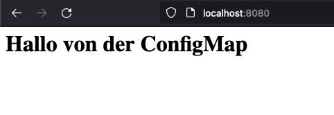

# Aufgabe 2: Praktische Aufgabe

## 1. Speicherung des Deployments als yaml Datei

- Wir haben im Praxis Teil des Kurses `kubectl create` genutzt um das Deployment zu erstellen.
  - `kubectl create deployment nginx-deployment --image=nginx`

- Finde einen Weg die aktuelle Version des Deployments bei dir als Yaml Datei abzuspeichern.
  - `kubectl get deploy nginx-deployment -oyaml > deploy.yaml`

## 2. Aktualisieren des nginx-Deployments zur Nutzung der ConfigMap

- Änderungen siehe `deploy.yaml`
- Anwenden der Änderungen `kubectl apply -f deploy.yaml`

## 3. Überprüfen des Deployments und des Mounts

- `kubectl rollout status deployment/nginx-deployment`

## 4. Zugriff auf den aktualisierten nginx-Webserver

- Stelle eine Verbindung zu einem der Pods des Deployment her, um auf die Startseite zuzugreifen.
- Nutze hierfür entweder k9s oder kubectl um ein Port-Forwarding einzurichten.
  - `kubectl port-forward svc/nginx-service 8080:80`

    
